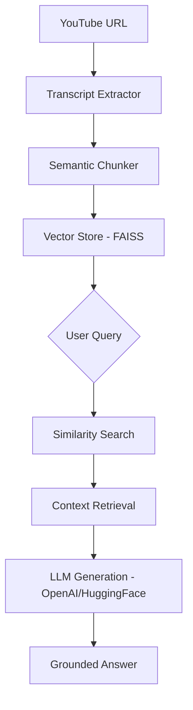

# 🔗 Ytransformer 
### Transforming YouTube Content into Interactive Knowledge

[](https://www.python.org/)
[](https://fastapi.tiangolo.com/)
[](https://streamlit.io/)
[](https://langchain.com/)
[](https://opensource.org/licenses/MIT)

**Ytransformer** is a high-performance Retrieval-Augmented Generation (RAG) system designed to let users chat with any YouTube video. By extracting transcripts, processing them into semantic clusters, and leveraging vector search, Ytransformer provides grounded, hallucination-free answers to complex queries about video content.


---

## 🌟 Key Features

- **🎯 Context-Aware QA**: Ask natural language questions and get answers grounded strictly in the video transcript.
- **🕒 Timestamp Precision**: (Coming Soon) Ask questions about specific segments and get results with direct links to moments in the video.
- **📄 Instant Summarization**: Generate high-level overviews of long-form content like podcasts, lectures, or technical talks.
- **🛡️ Hallucination Guard**: Uses a strict RAG pipeline to ensure the LLM only answers based on provided context.
- **⚡ Semantic Search**: Powered by FAISS and state-of-the-art sentence embeddings for high-speed retrieval.

---

## 🧠 System Architecture



---

## 🛠️ Tech Stack

- **Core Logic**: [LangChain](https://www.langchain.com/)
- **Backend**: [FastAPI](https://fastapi.tiangolo.com/) (Async API Design)
- **Frontend**: [Streamlit](https://streamlit.io/) (Interactive Dashboard)
- **Vector Engine**: [FAISS](https://github.com/facebookresearch/faiss) (Facebook AI Similarity Search)
- **Embeddings**: Sentence-Transformers / OpenAI
- **Language Models**: GPT-4 / Llama-3 (via LangChain)

---

## 🚀 Getting Started

### Prerequisites
- Python 3.11+
- Virtual environment (recommended)

### 1. Clone the repository
```bash
git clone https://github.com/Praroop1435/YT-RAG-Chatbot.git
cd YT-RAG-Chatbot
```

### 2. Setup Backend
```bash
cd backend
python -m venv .venv
source .venv/bin/activate # Windows: .venv\Scripts\activate
pip install -r requirements.txt # or use uv: uv sync
python -m uvicorn app.main:app --reload
```

### 3. Setup Frontend
```bash
cd ../frontend
python -m venv .venv
source .venv/bin/activate
pip install -r requirements.txt
streamlit run app.py
```

---

## 📌 Use Cases

- **Technical Learning**: Rapidly extract code snippets or concepts from 2-hour long tutorials.
- **Research**: Query multiple podcasts or interviews for specific insights without manual scrubbing.
- **Education**: Assistive tool for students to query lecture recordings.

---

## 📈 Future Roadmap

- [ ] **Multi-Video knowledge aggregation**: Chat with an entire playlist.
- [ ] **Source Verification**: Direct "Click-to-Jump" timestamps in chat responses.
- [ ] **Multimodal Support**: Processing visual frames for slide-heavy presentations.
- [ ] **Persistence**: User history saved via PostgreSQL/Supabase.

---

## 👨‍💻 Developer
**Praroop Anand**  
*Building the future of AI-driven knowledge retrieval.*

---
*Note: This project is intended for educational purposes and to showcase professional RAG implementation techniques.*
